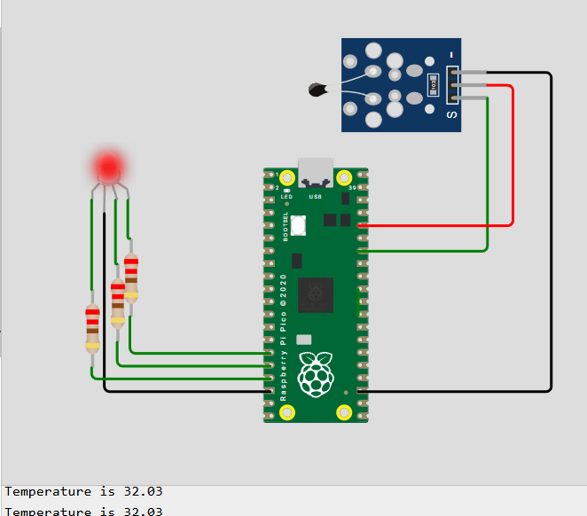

# Description
Basic Arduino project for Raspberry Pi Pico.
Script is reading temperature from analog temperature sensor.

# Credits
I used [Wokwi](https://wokwi.com/) to simulate the hardware.

# Example
Temp below 0:

Temp within 0-25:

Temp >25:

